## ==以权限点出发的鉴权核心思想：==

获取当前用户已有的权限点集合和接口声明的权限点集合，如果用户的权限点都包含了接口声明的权限点那就通过鉴权了：

更精简一下就是：**将用户的权限抽象为离散的权限点集合，通过比较用户拥有的权限点与接口要求的权限点来判断是否授权**。

具体流程：

1. 获取当前用户已有的权限点集合
2. 获取接口声明的权限点集合（即访问该接口所需的权限）
3. 检查用户权限点集合是否完全包含接口声明的权限点
   - 如果包含 → 鉴权通过
   - 如果不包含 → 鉴权失败

## 先看实现

通过这一个注解完成图库空间的鉴权功能

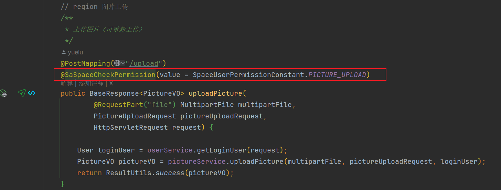

## 怎么实现的？

**底层依赖：**Sa-Token权限校验空间

**代码层实现：**自定义注解 + MVC拦截器

> 自定义注解中又包含：
>
> - **注解合并**：// 注解合并，相当于当前自定义的 @SaSpaceCheckPermission == @SaCheckPermission(type = StpKit.SPACE_TYPE)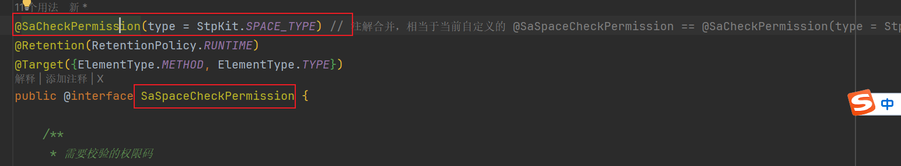
>
> MVC拦截器包含：
>
> - 注册 Sa-Token 拦截器，打开注解式鉴权功能：在preHandle方法进行鉴权处理
> - 重写Sa-Token的注解处理器，增加注解合并功能 

## 注解鉴权流程：

1. SaInterceptor拦截器（SaInterceptor是一个实现了HandlerInterceptor接口的Sa-Token拦截器）拦截到了一个请求，然后检查有没有注解并且注解是否属于要被拦截的方法（因为注册过拦截器，所以按理说所有被sa-Token注解的方法都属于被拦截的方法）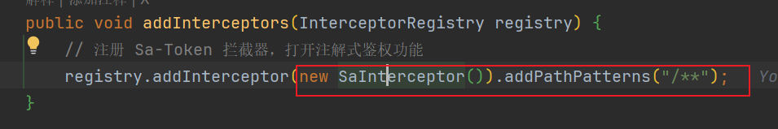

2. 成功识别到，那么就会走我们重写的SaAnnotationStrategy内部，Sa注解策略，在这个类里面我们先找到`checkMethodAnnotation`方法，不难看出这是遍历所有实现了SaAnnotationHandlerInterface接口的类，然后根据看看方法上的注解属于哪个类
   1. 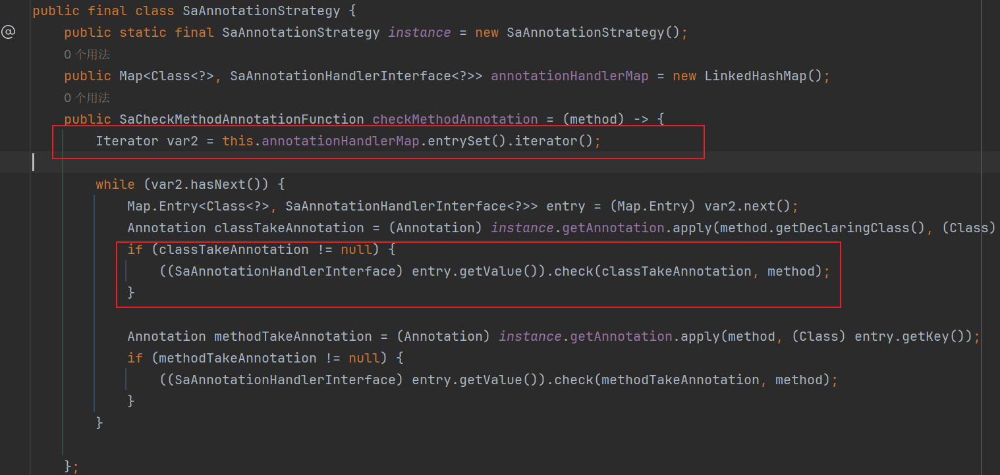
   2. 可以看出来获取到我们的注解信息了，然后调用check方法就到第三步了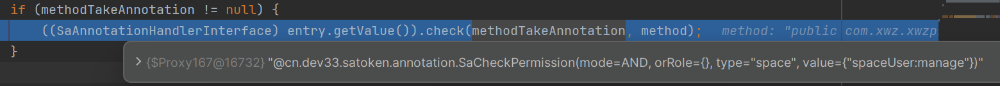
   3. 
   4. 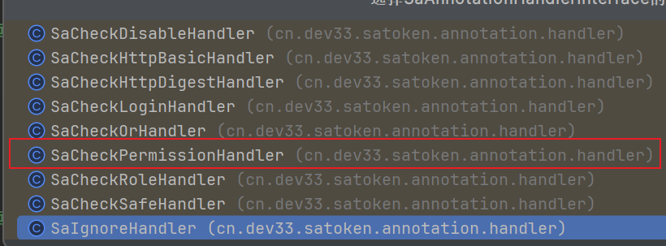
   5. 
3. 因为我们的自定义的@SaSpaceCheckPermission注解合并了@SaCheckPermission注解，所以就会选用到上面红框的处理类。最后，会用动态绑定的机制去调用实际的处理方法
   1. 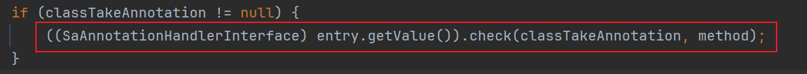
   2. 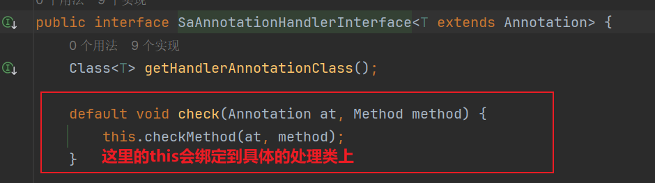
   3. 这里就是具体的处理方法内了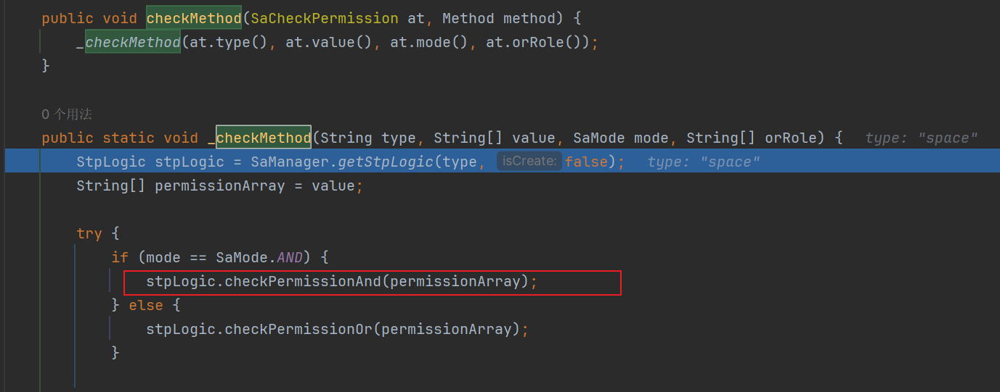
   4. 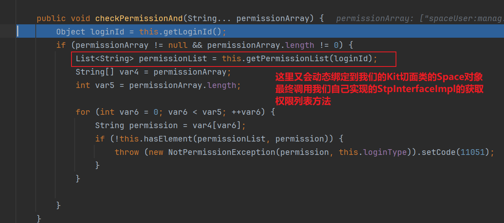
   5. 上面的this就指向的
4. 最终，通过我们自己写好的获取用户权限List方法，然后走到下面这一步进行比较（permissionList是我们获取到的用户权限List，permission就是注解中标记的权限点，例如下面是团队空间管理员尝试添加成员，注解标记是spaceUser:manage，然后当前用户是团队管理员，List里面肯定就包含了spaceUser:manage），然后就鉴权通过啦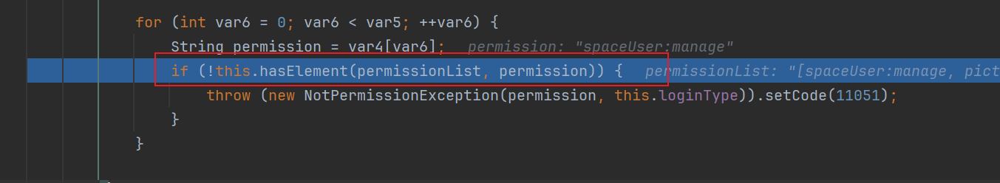

## Auth包下类的功能解析

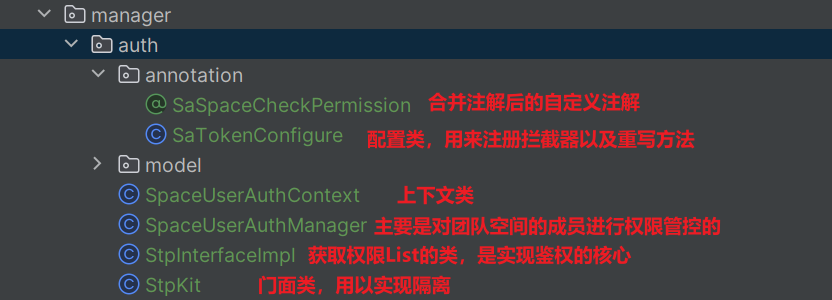

### annotation

SaSpaceCheckPermission：

> 注解合并后的自定义注解，相当于当前自定义的
>
>  @SaSpaceCheckPermission == @SaCheckPermission(type = StpKit.SPACE_TYPE)

SaTokenConfigure

> 注册 Sa-Token 拦截器，打开注解式鉴权功能
>
> 重写Sa-Token的注解处理器，增加注解合并功能 

### model

SpaceUserAuthContext

> 上下文类，囊括了现有的所有业务id与业务实体，例如图片，空间，空间成员的id和实体

SpaceUserAuthManager

> 主要是用以空间成员鉴权的，作为StpInterfaceImpl获取空间成员部分鉴权的依赖，并且也可作为编程式鉴权的依赖

StpInterfaceImpl

> 核心鉴权实现类，并且核心方法是getPermissionList返回的是当前用户所处的环境（公共，私有，团队）下的权限List，然后框架帮我们和注解上声明的权限点进行比对然后进行鉴权的

StpKit

> 门面类（其实我更愿意成为静态工厂类，因为该类就是有限个单例对象的再封装类），用来进行不同账号体系间的隔离的鉴权的

## 一点补充

### 前端鉴权

如上讨论的都是接口，也就是后端层的鉴权，我们如果想在页面上实现某些按钮不可以，就可以把权限List返回给前台，然后前台根据这些权限点来判断，基本上就是图片以及团队空间的详情页面

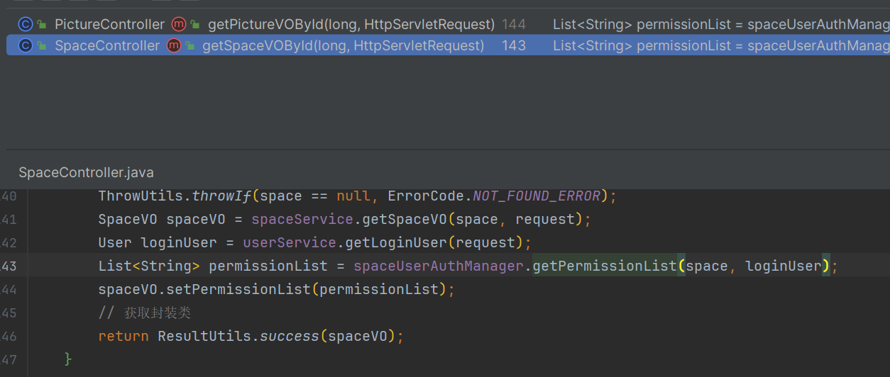

### 编程式鉴权

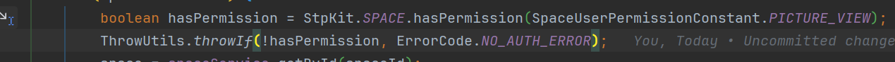

代表当前资源需要登录用户有读权限，这块的源码稍微看下就是

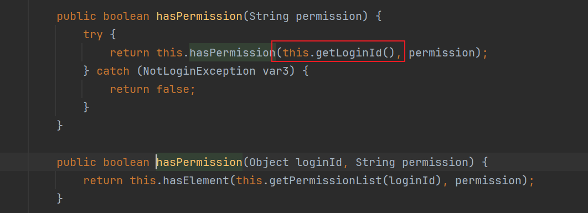

其中`this.getLoginId()`就是从集成的Redis里面读取到的用户ID，然后就走下面的鉴权方法了，还是一样的，获取到当前用户已经有的权限List，以及方法中声明的权限点，然后进行比对就好了，反正把握住**鉴权的核心思想**去理解整个流程，你会发现其实也不难的。