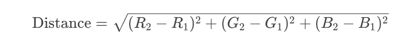

# 以图搜图

## 需求：

用户可以使用一张图片来搜索相似的图片，相比传统的关键词搜索，能够更精确地找到与上传图片内容相似的图片。

## 实现思路：

第三方API其实就有以图搜图的接口，比如说Bing，利用必应的图库，可以从全网进行搜索相关的图片 **而且可以免费使用**。[快速入门：使用必应图像搜索 REST API 和 Java 搜索图像 - 必应搜索服务 |Microsoft 学习](https://learn.microsoft.com/en-us/bing/search-apis/bing-image-search/quickstarts/rest/java)

概括一下就是：

构造需要以图搜图的入参（图片URL，image_source等等）然后调用外部API的以图搜图服务，然后对返回结果进行解析，处理，最终返回成结果list就行了，其实和公司做的类似需求差不多。

# 颜色搜图

## 需求：

能够按照颜色搜索空间内主色调最相以的图片。

## 实现思路：

- 在图片上传的时候解析出该图片的主色调然后存储在数据库
  - 怎么解析主色调？--数据万象服务
- 根据用户输入的颜色RGB值根据**相似度算法**与库里的色调进行匹配
  - 相似度算法的实现？--**RGB 欧氏距离**算法
    - 其实也有其他的相似度算法，这里用欧几里得距离是因为简单好用
- 按照匹配度进行顺序排序，返回图片List，越相似的越靠前

### 欧几里得距离算法

**原理**：将两种颜色看作三维空间中的点（R,G,B），计算两点间的直线距离。
**公式**：



**特点**：简单快速，但未考虑人眼感知差异。

```java
/**
 * 工具类：计算颜色相似度
 */
public class ColorSimilarUtils {

    private ColorSimilarUtils() {
        // 工具类不需要实例化
    }

    /**
     * 计算两个颜色的相似度
     *
     * @param color1 第一个颜色
     * @param color2 第二个颜色
     * @return 相似度（0到1之间，1为完全相同）
     */
    public static double calculateSimilarity(Color color1, Color color2) {
        int r1 = color1.getRed();
        int g1 = color1.getGreen();
        int b1 = color1.getBlue();

        int r2 = color2.getRed();
        int g2 = color2.getGreen();
        int b2 = color2.getBlue();

        // 计算欧氏距离
        double distance = Math.sqrt(Math.pow(r1 - r2, 2) + Math.pow(g1 - g2, 2) + Math.pow(b1 - b2, 2));

        // 计算相似度
        return 1 - distance / Math.sqrt(3 * Math.pow(255, 2));
    }

    /**
     * 根据十六进制颜色代码计算相似度
     *
     * @param hexColor1 第一个颜色的十六进制代码（如 0xFF0000）
     * @param hexColor2 第二个颜色的十六进制代码（如 0xFE0101）
     * @return 相似度（0到1之间，1为完全相同）
     */
    public static double calculateSimilarity(String hexColor1, String hexColor2) {
        Color color1 = Color.decode(hexColor1);
        Color color2 = Color.decode(hexColor2);
        return calculateSimilarity(color1, color2);
    }

    // 示例代码
    public static void main(String[] args) {
        // 测试颜色
        Color color1 = Color.decode("0xFF0000");
        Color color2 = Color.decode("0xFE0101");
        double similarity = calculateSimilarity(color1, color2);

        System.out.println("颜色相似度为：" + similarity);

        // 测试十六进制方法
        double hexSimilarity = calculateSimilarity("0xFF0000", "0xFE0101");
        System.out.println("十六进制颜色相似度为：" + hexSimilarity);
    }
}
```

# AI扩图功能

## 需求

针对用户上传的图片进行AI扩图功能（顺应AI浪潮，将AI应用到本项目作为亮点）

## 实现思路

要实现AI扩图的话还是需要依赖AI大模型的，这里使用阿里百炼

> 为什么用阿里百炼呢？因为免费，而且对接起来很容易，官方也提供了相关文档。[参考文档：](https://help.aliyun.com/zh/model-studio/image-scaling-api?utm_content=m_1000400274)

获取好了API key之后就可以按照官方文档进行接口开发了。因为AI扩图也算是个耗时任务，我们对耗时任务一般采用异步处理的方法的，需要发起两个请求：

- **步骤1：创建任务获取任务ID**：首先发送一个请求创建扩图任务，该请求会返回任务ID。
- **步骤2：根据任务ID查询结果**：使用上一步获得的任务ID，查询模型生成的结果。

页面创建好任务之后需要对任务执行结果进行获取，一般常用的方法有轮询，websocket长连接，这里其实对时效性要求不高的，所以选择轮询的方法实现，思路就是：

1. 前台点击AI扩图按钮，创建任务获取任务ID，根据传入的URL来构造入参，调用AI扩图的API，返回任务ID
2. 前台间隔500ms轮询调用任务查询接口 ，直到成功获取到返回结果

## 注意点

AI扩图依赖AI大模型资源，所以需要进行限流处理！


