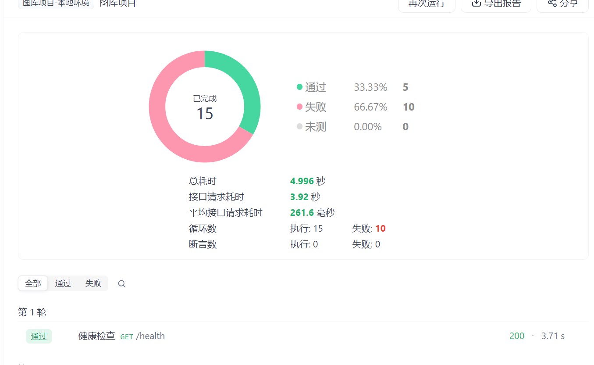
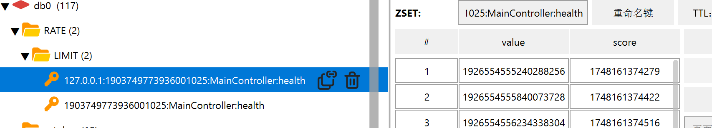

## 接口限流的必要性

老规矩，在实现一个功能之前先来讨论这个功能的业务价值

对于本项目来说，一个核心的数据存储层COS（对象存储）是一个付费的底座依赖，那么势必就需要考虑其安全性，最容易想到的就是下载接口，如果说不加限流的话恶意用户一次性就会将大量流量冲到COS上，有可能就直接把COS服务给冲停机了，所以限流是必须要加的。


## 限流的策略

因为预期要提供一个admin账号提供出去的，那么自然也需要对这个admin进行限制，那问题来了，对admin进行限制的话我自己不就也被限制住了么？

其实可以这样，再加一个“超级管理员”的角色，这个角色是整个项目的最高权限，干啥都没限制，并且只有我这个作者可以进授予。

所以现在思路就比较清晰了，我们的系统有这些角色：

- **超级管理员：**系统最高权限，任何的接口都没有限制。
- **普通管理员：**对耗资源型接口进行一定的限流，并且对用户管理，图片管理的删除操作进行限制
- **普通用户：**就沿用之前设计的权限进行限制

那么还有个问题，我们当前的主题是进行敏感接口的限流，那么针对对外提供的admin账号进行限流的话就需要 采用IP限流规则了，因为多个访问者都可以借助admin账号来访问我们的系统，所以就不能使用用户名的限流策略了，而需要使用IP进行限流。这就涉及到了**多规则限流**策略了

## 多规则限流策略

### 设计

我们先来考虑下最基本的限流怎么做，已知主流的限流策略包括固定窗口，滑动窗口，漏桶，令牌桶四种限流策略，[点我查看具体差异](https://juejin.cn/post/7145435951899574302?searchId=20250525124610F980C0F4BB321F288983)；

结合我们当前的系统特点：个人项目，未做公开宣传，用户群体不多，主要用于找工作演示，那么就采用比较灵活的**滑动窗口**进行限流。

然后就是多规则限流了，多规则又分为：

- 限流类型（根据IP还是用户名）
- 限流规则（100/min；1000/Hour）

也就是说一个类型下可以配置多个限流规则，这才是我们想要的效果

### 实现思路

#### 注解层

需要有三个注解来共同完成多规则：

1. **限流规则`@RateRule`：**限流次数，限流时间，限流时间单位
2. **限流类型`@RateLimiter`：**限流类型 (枚举类型)，对应限流规则`@RateRule[]`
3. **限流类型组`@RateLimiters`：**多个限流规则`@RateLimiter[]`

使用的时候声明限流类型组，在组内配置具体的类型和规则

#### 切面层

1. 请求打到接口之前先进行校验，查看用户是否登录：**依赖cookie传入sessionID**
2. 然后查看当前接口是否在当前窗口被调用：
   1. 涉及到限流key的设计，通过设计统一的前缀`RATE:LIMIT:` + 限流策略`IP || userId` + `类名:方法名`
      1. **IP限流key**：RATE:LIMIT:127.0.0.1:1903749773936001025:MainController:health
      2. **用户名限流key**：RATE:LIMIT:1903749773936001025:MainController:health
   2. 执行Lua脚本，查看是否被限流
   3. 限住了，抛出异常，没限住，走接口逻辑

#### Lua脚本具体逻辑：

首先接收三个参数分别是：

- 缓存key值
- 雪花ID
- 当前时间戳

然后还有`#ARGV`，这个就是通过注解获取到的限流规则，这是个可变参数，每两个为一个限流规则组

- rateRuleCount：限流次数
- rateRuleTime：限流时间

> ```lua
> -- 1. 获取参数
> local key = KEYS[1]
> local uniqueCode = KEYS[2]
> local currentTime = KEYS[3]
> -- 2. 以数组最大值为 ttl 最大值
> local expireTime = -1;
> -- 3. 遍历数组查看是否超过限流规则
> -- 3.1 #ARGV就是通过注解获取到的限流规则，rateRuleCount：限流次数；rateRuleTime：限流时间
> for i = 1, #ARGV, 2 do
>     local rateRuleCount = tonumber(ARGV[i])
>     local rateRuleTime = tonumber(ARGV[i + 1])
>     -- 3.1 判断在单位时间内访问次数：通过第三第四个参数来确实一个闭区间范围，来统计所有在这个范围内符合条件的元素（也就是总限流数）
>     local count = redis.call('ZCOUNT', key, currentTime - rateRuleTime, currentTime)
>     -- 3.2 判断总限流数是否超过规定上限，超过了就直接返回true走限流逻辑
>     if tonumber(count) >= rateRuleCount then
>         return true
>     end
>     -- 3.3 判断元素最大值，设置为最终过期时间
>     if rateRuleTime > expireTime then
>         expireTime = rateRuleTime
>     end
> end
> -- 4. redis 中添加当前时间
> redis.call('ZADD', key, currentTime, uniqueCode)
> -- 5. 更新缓存过期时间
> redis.call('PEXPIRE', key, expireTime)
> -- 6. 删除最大时间限度之前的数据，防止数据过多
> redis.call('ZREMRANGEBYSCORE', key, 0, currentTime - expireTime)
> return false
> 
> ```
>
> ---
>
> ## **代码解析**
>
> ### **1. 参数说明**
>
> - `KEYS[1]`：限流的 Redis Key
>   - 如 `RATE:LIMIT:127.0.0.1:1903749773936001025:MainController:health`
> - `KEYS[2]`：唯一标识（雪花ID，用于记录当前请求）。
> - `KEYS[3]`：当前时间戳（毫秒级）。
> - `ARGV`：可变参数，格式为 `[count1, timeWindow1, count2, timeWindow2, ...]`，表示多个限流规则（如 `5, 1000, 10, 60000` 表示 5次/秒 和 10次/分钟）。
>
> ### **2. 主要逻辑**
>
> #### **(1) 遍历限流规则**
>
> ```lua
> for i = 1, #ARGV, 2 do
>     local rateRuleCount = tonumber(ARGV[i])   -- 允许的请求次数（如 5）
>     local rateRuleTime = tonumber(ARGV[i + 1]) -- 时间窗口（如 1000ms）
> ```
>
> - 检查每个时间窗口内的请求是否超限：
>
>   ```lua
>   local count = redis.call('ZCOUNT', key, currentTime - rateRuleTime, currentTime)
>   ```
>
>   - `ZCOUNT` 计算 `key` 在 `[currentTime - timeWindow, currentTime]` 内的请求数，这是个时间区间
>   - 如果 `count >= rateRuleCount`，返回 `true`（限流生效）。
>
> #### **(2) 更新过期时间**
>
> ```lua
> if rateRuleTime > expireTime then
>     expireTime = rateRuleTime
> end
> ```
>
> - 取所有规则中 **最大的时间窗口** 作为 Redis Key 的过期时间（避免小覆盖大导致长时间窗口发生不期望的过期）。
>
> #### **(3) 记录当前请求**
>
> ```lua
> redis.call('ZADD', key, currentTime, uniqueCode)
> ```
>
> - 用 `ZADD` 将当前请求的时间戳和唯一标识存入 Sorted Set（`score=时间戳, member=uniqueCode`）。
>
> #### **(4) 清理旧数据**
>
> ```lua
> redis.call('ZREMRANGEBYSCORE', key, 0, currentTime - expireTime)
> ```
>
> - 删除 `expireTime` 之前的数据（如 `currentTime - 60000` 删除 1 分钟前的记录）。
>
> #### **(5) 返回结果**
>
> - 如果所有规则均未超限，返回 `false`（允许请求）。
>
> ---
>
> ## **时序图**
>
> ```mermaid
> sequenceDiagram
>     participant Client
>     participant Redis
>     participant LuaScript
> 
>     Client->>Redis: EVAL LuaScript (KEYS, ARGV)
>     Redis->>LuaScript: 执行脚本
> 
>     loop 遍历限流规则
>         LuaScript->>Redis: ZCOUNT key (currentTime - window, currentTime)
>         Redis-->>LuaScript: 返回计数
>         alt 计数 >= 限制
>             LuaScript-->>Client: 返回 true（限流）
>         end
>     end
> 
>     LuaScript->>Redis: ZADD key (currentTime, uniqueCode)
>     LuaScript->>Redis: PEXPIRE key (maxWindowTime)
>     LuaScript->>Redis: ZREMRANGEBYSCORE key (0, currentTime - maxWindowTime)
>     Redis-->>LuaScript: 操作完成
>     LuaScript-->>Client: 返回 false（允许）
> ```
>
> ---
>
> ## **关键点**
>
> 1. **滑动窗口机制**  
>    - 通过 `ZCOUNT` 动态计算最近 `timeWindow` 内的请求数，避免固定窗口的边界问题。
> 2. **数据清理**  
>    - 使用 `ZREMRANGEBYSCORE` 清理旧数据，防止 Sorted Set 无限膨胀。
> 3. **多规则支持**  
>    - 支持多个时间窗口（如 5次/秒 + 100次/分钟），只要任一规则触发即限流。
> 4. **原子性**  
>    - Lua 脚本在 Redis 中原子执行，避免并发问题。
>
> ---
>
> # 实例
>
> 我们通过一个 **具体实例** 来说明这段 **滑动窗口限流代码** 的运行逻辑。假设有一个API接口，需要对每个用户进行限流，规则如下：
>
> ### **限流规则**
> - **规则1**：每秒不超过 `5` 次请求（时间窗口 `1000ms`）。
> - **规则2**：每分钟不超过 `100` 次请求（时间窗口 `60000ms`）。
>
> ---
>
> ## **实例场景**
> ### **用户请求时序**
> 假设用户 `user123` 在以下时间点发起请求（时间戳单位：毫秒）：
>
> | 请求编号 | 时间戳（ms） | 说明                     |
> | -------- | ------------ | ------------------------ |
> | 1        | 1000         | 第1秒的第0ms（初始请求） |
> | 2        | 1200         | 第1秒的第200ms           |
> | 3        | 1500         | 第1秒的第500ms           |
> | 4        | 1800         | 第1秒的第800ms           |
> | 5        | 1900         | 第1秒的第900ms           |
> | 6        | 2000         | 第2秒的第0ms（关键点！） |
>
> ---
>
> ## **代码执行步骤（以请求6为例）**
> ### **1. 参数传入**
> - `KEYS[1] = "rate_limit:user123"`（限流的Redis Key）
> - `KEYS[2] = "uuid-2000"`（请求6的唯一标识）
> - `KEYS[3] = 2000`（当前时间戳）
> - `ARGV = [5, 1000, 100, 60000]`（限流规则数组）
>
> ### **2. 遍历限流规则**
> #### **(1) 检查规则1：5次/秒**
> - 计算时间窗口：`2000 - 1000 = 1000`（统计 `1000ms~2000ms` 的请求）
> - 执行 `ZCOUNT rate_limit:user123 1000 2000`：
>   - 返回的请求记录：`[1000, 1200, 1500, 1800, 1900]`（共5次）
>   - **判定**：`5 >= 5` → **触发限流**，直接返回 `true`（拒绝请求6）。
>
> #### **(2) 如果规则1未触发，继续检查规则2：100次/分钟**
> （本例中无需执行，因为规则1已触发）
>
> ---
>
> ## **如果没有限流会怎样？**
> 假设请求5（时间戳 `1900`）是当前最后一次请求，后续请求6的时间戳是 `2100`（未超限）：
>
> ### **1. 检查规则1：5次/秒**
> - 时间窗口：`2100 - 1000 = 1100`（统计 `1100~2100` 的请求）
> - `ZCOUNT` 返回：`[1200, 1500, 1800, 1900]`（共4次）
> - `4 < 5` → 未触发限流。
>
> ### **2. 检查规则2：100次/分钟**
> - 时间窗口：`2100 - 60000 = -57900`（统计 `0~2100` 的请求）
> - `ZCOUNT` 返回：`[1000, 1200, 1500, 1800, 1900]`（共5次）
> - `5 < 100` → 未触发限流。
>
> ### **3. 通过限流后的操作**
> 1. **记录当前请求**：
>    ```lua
>    redis.call('ZADD', 'rate_limit:user123', 2100, 'uuid-2100')
>    ```
>    - Sorted Set 新增一个元素：：`(score=2100, member="uuid-2100")`。
> 2. **设置Key过期时间**：
>    ```lua
>    redis.call('PEXPIRE', 'rate_limit:user123', 60000)
>    ```
>    - 取最大窗口 `60000ms`（1分钟）作为Key的TTL。
> 3. **清理旧数据**：
>    ```lua
>    redis.call('ZREMRANGEBYSCORE', 'rate_limit:user123', 0, 2100 - 60000)
>    ```
>    - 删除 `score <= -57900` 的数据（实际无数据可删）。
>
> ---
>
> ## **Redis 数据变化示例**
> ### **初始状态（请求1~5）**
> | Sorted Set (`rate_limit:user123`) |
> | --------------------------------- |
> | (score=1000, member="uuid-1000")  |
> | (score=1200, member="uuid-1200")  |
> | (score=1500, member="uuid-1500")  |
> | (score=1800, member="uuid-1800")  |
> | (score=1900, member="uuid-1900")  |
>
> ### **请求6被限流后**
> - 数据不变（因为 `ZADD` 未执行）。
> - 用户收到 `429 Too Many Requests`。
>
> ### **请求6通过限流后（假设时间戳2100）**
> | Sorted Set (`rate_limit:user123`) |
> | --------------------------------- |
> | (score=1000, member="uuid-1000")  |
> | (score=1200, member="uuid-1200")  |
> | (score=1500, member="uuid-1500")  |
> | (score=1800, member="uuid-1800")  |
> | (score=1900, member="uuid-1900")  |
> | (score=2100, member="uuid-2100")  |
>
> ---
>
> ## **关键结论**
> 1. **滑动窗口的精确性**  
>    - 统计的是 **动态时间窗口**（如 `2000ms~1000ms`），而非固定窗口（如第1秒、第2秒）。
> 2. **多规则优先级**  
>    - 任一规则触发即限流（如先检查秒级规则，再检查分钟级规则）。
> 3. **数据清理**  
>    - 自动清理过期数据（如 `ZREMRANGEBYSCORE`），避免内存泄漏。
>
> ---
>
> ## **适用场景**
> - **API限流**：防止用户高频调用接口。
> - **秒杀系统**：控制商品抢购请求速率。
> - **分布式环境**：通过Redis实现全局限流。

### 实现效果

#### 配置


#### 测试






## 扩展

### 重点代码详解-Lua脚本命令

#### ZCOUNT

> 这段代码是使用Lua脚本在Redis中执行的一个命令，用于计算有序集合（sorted set）中某个范围内的元素数量。具体来说，它计算的是在某个时间范围内的元素数量。下面是对这段代码的详细解释：
>
> 1. **`local count`**:
>    - 定义一个局部变量 `count`，用于存储计算结果。
>
> 2. **`redis.call('ZCOUNT', key, currentTime - rateRuleTime, currentTime)`**:
>    - `redis.call` 是一个Redis Lua脚本中用于调用Redis命令的函数。
>    - `'ZCOUNT'` 是Redis的一个命令，用于计算有序集合中指定范围内的元素数量。
>    - `key` 是有序集合的键名。
>    - `currentTime - rateRuleTime` 是范围的起始值，表示时间范围的下限。
>    - `currentTime` 是范围的结束值，表示时间范围的上限。
>
> ### 具体解释
> 假设 `key` 是有序集合的键名，`currentTime` 是当前时间，`rateRuleTime` 是一个时间间隔（例如，1分钟），那么这段代码的作用是计算在当前时间 `currentTime` 和 `currentTime - rateRuleTime` 之间的元素数量。
>
> ### 示例
> 假设 `key` 是 `"myzset"`，`currentTime` 是 `2023-10-01 12:00:00`，`rateRuleTime` 是 `60`（表示1分钟），那么这段代码会计算在 `2023-10-01 11:59:00` 到 `2023-10-01 12:00:00` 之间的元素数量。
>
> ### 代码执行流程
> 1. 调用 `redis.call` 函数，执行 `ZCOUNT` 命令。
> 2. `ZCOUNT` 命令会返回在指定范围内的元素数量。
> 3. 将返回的结果赋值给局部变量 `count`。
>
> ### 使用场景
> 这种计算通常用于限流、速率限制等场景，例如，计算在某个时间窗口内某个操作发生的次数，以判断是否超过了设定的速率限制。

#### ZADD

>解释：redis.call('ZADD', key, currentTime, uniqueCode)
>
>这段代码是使用Lua脚本在Redis中执行的一个命令，用于向有序集合（sorted set）中添加一个元素。具体来说，它将一个唯一的标识符（`uniqueCode`）添加到有序集合中，并为其指定一个分数（`currentTime`）。下面是对这段代码的详细解释：
>
>1. **`redis.call('ZADD', key, currentTime, uniqueCode)`**:
>   - `redis.call` 是一个Redis Lua脚本中用于调用Redis命令的函数。
>   - `'ZADD'` 是Redis的一个命令，用于向有序集合中添加一个或多个成员及其分数。
>   - `key` 是有序集合的键名。
>   - `currentTime` 是成员的分数，用于确定成员在有序集合中的位置。
>   - `uniqueCode` 是要添加到有序集合中的成员，通常是一个唯一的标识符。
>
>### 具体解释
>假设 `key` 是有序集合的键名，`currentTime` 是当前时间，`uniqueCode` 是一个唯一的标识符（例如，用户ID、订单号等），那么这段代码的作用是将 `uniqueCode` 添加到 `key` 对应的有序集合中，并为其指定一个分数 `currentTime`。
>
>### 示例
>假设 `key` 是 `"myzset"`，`currentTime` 是 `2023-10-01 12:00:00`，`uniqueCode` 是 `"user123"`，那么这段代码会将 `"user123"` 添加到 `"myzset"` 对应的有序集合中，并为其指定分数 `2023-10-01 12:00:00`。
>
>### 代码执行流程
>1. 调用 `redis.call` 函数，执行 `ZADD` 命令。
>2. `ZADD` 命令会将 `uniqueCode` 添加到 `key` 对应的有序集合中，并为其指定分数 `currentTime`。
>3. 如果 `uniqueCode` 已经存在于有序集合中，`ZADD` 命令会更新其分数。
>
>### 使用场景
>这种操作通常用于需要记录时间戳和唯一标识符的场景，例如，记录用户操作、订单处理等。通过将时间戳作为分数，可以方便地按时间顺序获取有序集合中的元素。

#### ZREMRANGEBYSCORE

> **解释：redis.call('ZREMRANGEBYSCORE', key, 0, currentTime - expireTime)**
>
> 这段代码是使用Lua脚本在Redis中执行的一个命令，用于从有序集合（sorted set）中删除指定范围内的元素。具体来说，它将删除分数在 `0` 到 `currentTime - expireTime` 之间的所有元素。下面是对这段代码的详细解释：
>
> 1. **`redis.call('ZREMRANGEBYSCORE', key, 0, currentTime - expireTime)`**:
>    - `redis.call` 是一个Redis Lua脚本中用于调用Redis命令的函数。
>    - `'ZREMRANGEBYSCORE'` 是Redis的一个命令，用于删除有序集合中指定分数范围内的元素。
>    - `key` 是有序集合的键名。
>    - `0` 是范围的起始值，表示分数的下限。
>    - `currentTime - expireTime` 是范围的结束值，表示分数的上限。
>
> ### 具体解释
> 假设 `key` 是有序集合的键名，`currentTime` 是当前时间，`expireTime` 是一个时间间隔（例如，1分钟），那么这段代码的作用是删除在当前时间 `currentTime` 和 `currentTime - expireTime` 之间的所有元素。
>
> ### 示例
> 假设 `key` 是 `"myzset"`，`currentTime` 是 `2023-10-01 12:00:00`，`expireTime` 是 `60000`（表示60秒），那么这段代码会删除在 `2023-10-01 11:59:00` 到 `2023-10-01 12:00:00` 之间的所有元素。
>
> ### 代码执行流程
> 1. 调用 `redis.call` 函数，执行 `ZREMRANGEBYSCORE` 命令。
> 2. `ZREMRANGEBYSCORE` 命令会删除 `key` 对应的有序集合中分数在 `0` 到 `currentTime - expireTime` 之间的所有元素。
> 3. 返回被删除的元素数量。
>
> ### 使用场景
> 这种操作通常用于需要清理过期数据或历史数据的场景，例如，缓存、日志管理等。通过删除指定范围内的元素，可以避免数据过多占用存储空间，并提高查询效率。

## 踩坑

### lua脚本序列号问题：

通过自定义redisTemplate的Bean解决

```java
    @Bean
    public RedisTemplate<String, Object> redisTemplate(RedisConnectionFactory redisConnectionFactory) {
        RedisTemplate<String, Object> redisTemplate = new RedisTemplate<>();
        redisTemplate.setConnectionFactory(redisConnectionFactory)
        redisTemplate.setKeySerializer(RedisSerializer.string());
        redisTemplate.setValueSerializer(RedisSerializer.json());
        redisTemplate.setHashKeySerializer(RedisSerializer.string());
        redisTemplate.setHashValueSerializer(RedisSerializer.json());
        redisTemplate.afterPropertiesSet();
        return redisTemplate;
    }
```

### Lua脚本调试插件：

https://blog.csdn.net/WXD444725262/article/details/109751882

https://blog.csdn.net/qqooopp123/article/details/108795071

