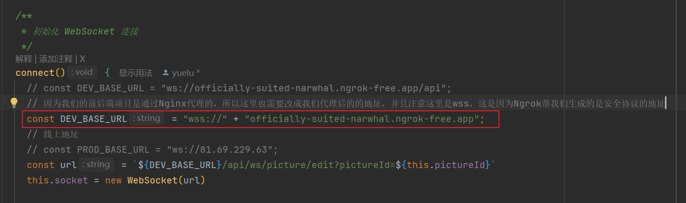

## 代理问题

### 背景：

因为当前项目内网穿透的特殊性，并且结合WebSocket协议的特殊性，我们必须把多人协同编辑的接口给再单独配置一下，否则会连接失败，整体思路就是：

1. 前端实际调用的后端服务是ws协议下的WebSocket服务地址
2. 那么我们就需要将后端的这个服务地址同样交给Nginx代理

其实也简单，加配置就行了，不过要注意的是，这里在前端配置的地址需要走Nginx代理的路径，但是这样的话，因为Ngrok帮我们生成的是带有安全证书的https，所以这里也得改成wss才可以，否则浏览器就会出于安全考虑阻止了这种行为。

## 具体配置：

**前端：**



**Nginx服务器：**

```ini
        # WebSocket 代理配置
        location /api/ws/picture/edit {
            proxy_pass http://localhost:8123/api/ws/picture/edit;
            
            # WebSocket 必需头设置
            proxy_http_version 1.1;
            proxy_set_header Upgrade $http_upgrade;
            proxy_set_header Connection "upgrade";
            
            # 其他重要头信息
            proxy_set_header Host $host;
            proxy_set_header X-Real-IP $remote_addr;
            proxy_set_header X-Forwarded-For $proxy_add_x_forwarded_for;
            
            # 长连接超时设置
            proxy_read_timeout 86400s;  # 1天
            proxy_send_timeout 86400s;
        }
```

## DS解答

Q: 前端调用后端的WebSocket地址是：ws://localhost:8123/api/ws/picture/edit，如何在Nginx进行配置？

# Nginx 配置代理 WebSocket 服务 (ws://localhost:8123)

要将前端通过 Nginx 代理访问后端的 WebSocket 服务 (`ws://localhost:8123/api/ws/picture/edit`)，请按照以下步骤配置：

## 基础配置方案

```nginx
server {
    listen 80;
    server_name yourdomain.com;  # 替换为你的域名或服务器IP

    # WebSocket 代理配置
    location /api/ws/picture/edit {
        proxy_pass http://localhost:8123/api/ws/picture/edit;
        
        # WebSocket 必需头设置
        proxy_http_version 1.1;
        proxy_set_header Upgrade $http_upgrade;
        proxy_set_header Connection "upgrade";
        
        # 其他重要头信息
        proxy_set_header Host $host;
        proxy_set_header X-Real-IP $remote_addr;
        proxy_set_header X-Forwarded-For $proxy_add_x_forwarded_for;
        
        # 长连接超时设置
        proxy_read_timeout 86400s;  # 1天
        proxy_send_timeout 86400s;
    }

    # 其他HTTP路由配置
    location / {
        proxy_pass http://localhost:8123;
        proxy_set_header Host $host;
    }
}
```

## 配置说明

1. **路径匹配**：
   - `location /api/ws/picture/edit` 匹配前端请求的WebSocket路径
   - `proxy_pass` 指向后端实际的WebSocket服务地址

2. **关键头信息**：
   - `Upgrade: websocket` 和 `Connection: upgrade` 完成HTTP到WebSocket的协议升级
   - `Host` 头确保后端能识别原始请求域名

3. **超时设置**：
   - WebSocket是长连接，需要设置较长的超时时间

## HTTPS 安全配置 (推荐)

```nginx
server {
    listen 443 ssl;
    server_name yourdomain.com;
    
    # SSL证书配置
    ssl_certificate /path/to/cert.pem;
    ssl_certificate_key /path/to/key.pem;
    
    # WebSocket配置
    location /api/ws/picture/edit {
        proxy_pass http://localhost:8123/api/ws/picture/edit;
        proxy_http_version 1.1;
        proxy_set_header Upgrade $http_upgrade;
        proxy_set_header Connection "upgrade";
        proxy_set_header Host $host;
        proxy_read_timeout 86400s;
    }
    
    # HTTP自动跳转HTTPS
    server {
        listen 80;
        server_name yourdomain.com;
        return 301 https://$host$request_uri;
    }
}
```

## 前端连接方式

根据Nginx配置，前端应使用以下连接方式：

```javascript
// 根据Nginx监听的协议选择ws或wss
const protocol = window.location.protocol === 'https:' ? 'wss:' : 'ws:';
const socketUrl = `${protocol}//${window.location.host}/api/ws/picture/edit`;

const socket = new WebSocket(socketUrl);
```

## 常见问题解决

1. **连接失败**：
   - 检查Nginx错误日志：`tail -f /var/log/nginx/error.log`
   - 确认后端服务(`localhost:8123`)正在运行且可访问

2. **403 Forbidden**：
   - 确保Nginx有权限访问后端服务
   - 检查后端CORS设置

3. **连接立即断开**：
   - 验证`Upgrade`和`Connection`头是否正确设置
   - 检查后端WebSocket实现是否完整

4. **跨域问题**：
   ```nginx
   location /api/ws/picture/edit {
       # ...其他配置
       add_header 'Access-Control-Allow-Origin' '$http_origin';
       add_header 'Access-Control-Allow-Credentials' 'true';
       add_header 'Access-Control-Allow-Methods' 'GET, POST, OPTIONS';
       add_header 'Access-Control-Allow-Headers' 'DNT,User-Agent,X-Requested-With,If-Modified-Since,Cache-Control,Content-Type,Range';
   }
   ```

## 性能优化建议

1. 增加Nginx的WebSocket连接限制：
   ```nginx
   http {
       proxy_connect_timeout 7d;
       proxy_send_timeout 7d;
       proxy_read_timeout 7d;
   }
   ```

2. 对于高并发场景，调整操作系统限制：
   ```bash
   # 临时生效
   ulimit -n 65535
   
   # 永久生效（在/etc/security/limits.conf中添加）
   * soft nofile 65535
   * hard nofile 65535
   ```

3. 启用压缩（如果传输大量数据）：
   ```nginx
   proxy_set_header Sec-WebSocket-Extensions "permessage-deflate; client_max_window_bits";
   ```

这样配置后，Nginx将正确代理WebSocket连接，前端可以通过访问Nginx的地址来连接到后端的WebSocket服务。