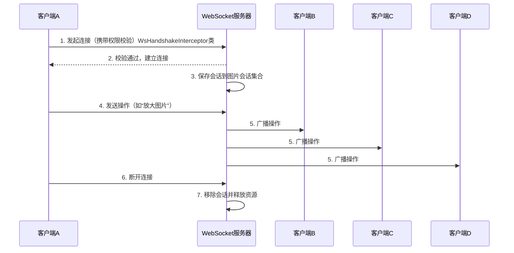
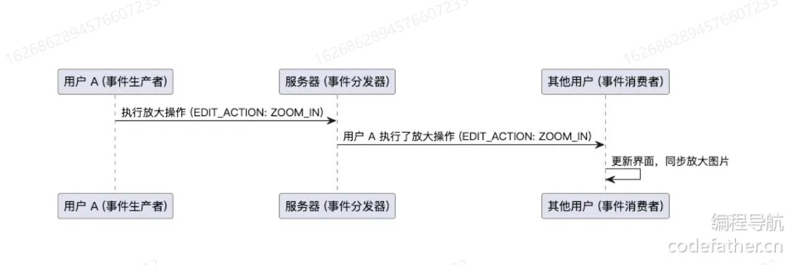
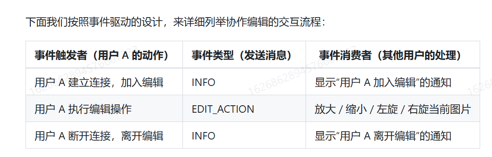
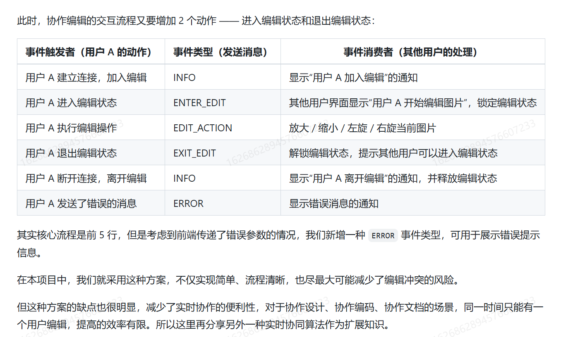
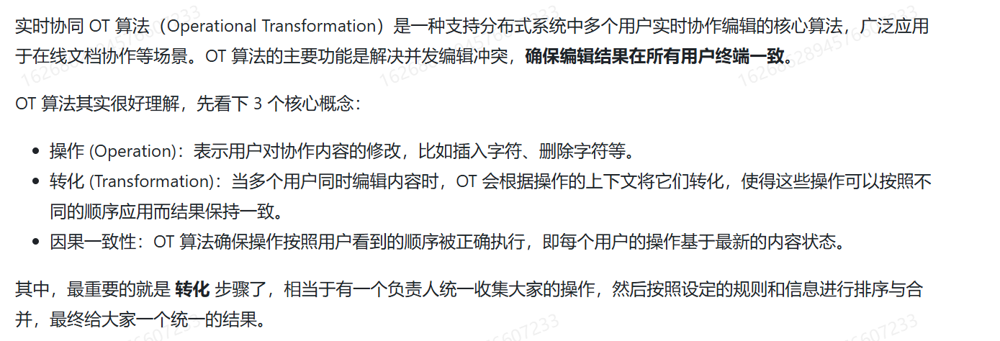
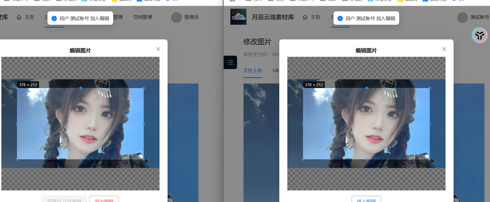
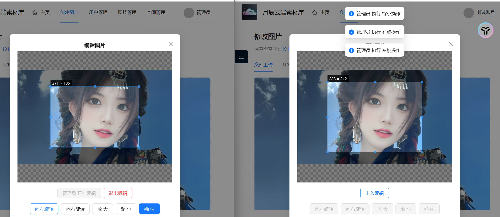

## 需求背景

因为团队空间的图片支持编辑，那么假设这样一个场景，用户A想要编辑图片X，先进入了图片编辑页面，然后用户B同时也想编辑图片X，也进入了图片编辑页面，然后双方同时点保存之后会发生什么？

这是不是就是很经典的并发冲突场景了，我们从业务角度先来思考一下改如何解决这种问题：

**多实例：**允许多个用户同时访问编辑，但是最终保存结果的时候相当于是根据原图复制出来一张图，在这个副本上进行编辑操作保存的（这就很像ThreadLocal的实现）

**加互斥锁：**在用户A进入编辑页面的时候就通知后台这个图片现在正在处于编辑状态，其他用户**不能**进入编辑页面

**加共享锁：**在用户A进入编辑页面的时候就通知后台这个图片现在正在处于编辑状态，其他用户**可以**进入编辑页面，并且可以看到其他用户当前进行的修改操作，但是得等其他用户退出编辑之后才可以编辑，锁粒度更细

从实现层角度来说，多实例和互斥锁都能满足并发安全且相对更好实现，共享锁的方案用户体验肯定是更好的，但是想要是比较困难的，关键的难点就在于：**不同用户操作之间的通讯！**，很显然想要实现的话https协议的接口就存在很多弊端，每次操作都调用接口，IO，网络啥的都会影响，所以这里就需要引入**全双工通讯协议WebSocket**

## WebSocket

### 是什么？

**WebSocket** 是一种网络通信协议，用于在客户端（如浏览器）和服务器之间建立**全双工（双向）**、**持久化**的连接，允许数据实时、高效地传输。与传统的 HTTP 请求（需要频繁建立和断开连接）不同，WebSocket 在初次握手后保持连接开放，双方可以随时发送数据，非常适合实时应用。

#### **关键特性**

1. **全双工通信**
   - 客户端和服务器可以**同时发送和接收数据**，无需等待请求-响应模式。
2. **低延迟**
   - 建立连接后，数据直接通过开放的通道传输，避免了 HTTP 的重复握手开销。
3. **持久化连接**
   - 一次握手后，连接会保持活跃，直到主动关闭（节省了 TCP 连接重建的开销）。
4. **支持文本和二进制数据**
   - 可以传输 JSON、XML、二进制数据（如视频、音频流）等格式。
5. **基于事件驱动**
   - 通过事件监听（如 `onopen`, `onmessage`）处理数据，代码更简洁。

### 适用场景？

WebSocket的自大特性就行双向实时通讯，所以**任何强实时性的系统（频繁交互或者实时更新数据）**都适用

- **实时聊天**（如微信网页版、Slack）
- **在线游戏**（多人协作或对战）
- **股票行情推送**（实时价格更新）
- **协同编辑工具**（如 Google Docs）
- **IoT 设备控制**（远程监控设备状态）

### 和HTTP的关系？

WebSocket和HTTP是两种不同的通信协议，但它们是紧密相关的，都是基于TCP协议、都可以在同样的端口上工作(比如80和443)。

**首先要明确，VebSocket是建立在HTTP基础之上的！**

WebSocket的连接需要通过HTTP协议发起一个握手（称为HTTP Upgrade请求)，这个握手请求是WebSocket建立连接的前提，表明希望切换协议；服务器如果支持WebSocket, 会返回一个HTTP101状态码，表示协议切换成功。
握手完成后，HTTP协议的作用结束，通信会切换为WebSocket协议，双方可以开始全双工通信。

#### 区别

HTTP就像点外卖：每次下单（请求）-到货（响应）都是一次独立的操作，完成后连接关闭。

WebSocket像是打电话：你打通了电话（建立连接），可以随时聊天（双向通信），直到挂断（关闭连接）。

| 特性         | WebSocket                    | HTTP                                                |
| :----------- | :--------------------------- | :-------------------------------------------------- |
| **连接方式** | 持久化，**双向**             | 短连接（每次请求创建新连接），**单向**（请求-响应） |
| **通信模式** | 服务器可主动推送数据         | 必须由客户端发起请求                                |
| **头部开销** | 首次握手后，数据帧头部极小   | 每次请求需携带完整请求头部                          |
| **适用场景** | 实时应用（聊天、游戏、股票） | 静态资源获取、传统 API                              |

### 怎么实现的？

在 Java Spring 项目中，WebSocket 的实现主要有以下三种方式：  

1. **原生 WebSocket（基于 `WebSocketHandler` 实现）**  
   - **特点**：底层 API，需手动管理连接与消息分发。  
   - **优点**：轻量、灵活，适合简单点对点通信。  
   - **缺点**：需自行处理会话和消息路由，不支持 STOMP 协议。  
   - **适用场景**：简单的实时推送或低并发需求（如通知提醒）。  

2. **WebSocket + STOMP + SockJS**  
   - **特点**：基于 STOMP 协议，提供发布/订阅模式。  
   - **优点**：内置消息代理（如 RabbitMQ）、兼容 SockJS（支持降级）。  
   - **缺点**：依赖外部代理，配置较复杂。  
   - **适用场景**：复杂实时应用（如聊天室、多人协同编辑）。  

3. **WebFlux + Reactive WebSocket**  
   - **特点**：基于响应式编程模型（非阻塞 IO）。  
   - **优点**：支持高并发、大数据流推送。  
   - **缺点**：学习成本高，不支持 STOMP。  
   - **适用场景**：高频数据流（如股票行情、IoT 设备监控）。  

**选型建议**：  
- 简单实时推送 → 原生 WebSocket  
- 复杂协作系统 → WebSocket + STOMP + SockJS  
- 高并发数据流 → WebFlux + Reactive WebSocket  

当前项目因并发要求不高，优先选择 **原生 WebSocket** 以降低开发复杂度。  

| 实现方式                | 特点                      | 优点                      | 缺点                          | 适用场景                  |
| ----------------------- | ------------------------- | ------------------------- | ----------------------------- | ------------------------- |
| **原生 WebSocket**      | 底层 API，手动管理会话    | 轻量、灵活                | 需手动分发消息，无 STOMP 支持 | 简单实时推送（低并发）    |
| **WebSocket+STOMP**     | 基于 STOMP，发布/订阅模式 | 支持消息代理，兼容 SockJS | 依赖外部代理，配置复杂        | 聊天室、多人协作          |
| **WebFlux+Reactive WS** | 响应式非阻塞 IO           | 高并发、低延迟            | 学习曲线陡峭                  | 高频数据流（如股票、IoT） |

- **开发成本**：原生 WebSocket 最低，适合功能简单的场景。  
- **功能扩展性**：STOMP 提供标准化消息模型，适合复杂业务。  
- **性能瓶颈**：WebFlux 解决高并发问题，但需权衡团队技术储备。

### 在项目中怎么用？

通过 WebSocket 实现多用户实时协同编辑图片的流程如下：

1. **用户权限校验**
   - 在建立 WebSocket 连接前，先验证用户权限。
   - 校验通过后，将用户信息（如用户ID）和当前编辑的图片信息绑定到 WebSocket 会话属性中。
2. **连接建立与会话管理**
   - 连接成功后，将该 WebSocket 会话保存到当前图片对应的会话集合中（便于后续消息广播）。
3. **消息处理与转发**
   - 前端（如客户端A）发送编辑操作（如“放大图片”）到后端。
   - 后端根据消息类型调用对应的处理器。
   - 处理器生成结果后，将消息广播给同一图片会话集合中的其他客户端（B、C、D）。
4. **连接关闭与资源释放**
   - 当用户断开连接时，从会话集合中移除对应的 WebSocket 会话，释放资源。




**关键点说明**

- **会话集合**：以图片ID为键，存储所有正在编辑该图片的 WebSocket 会话，实现精准广播。
- **消息类型**：可定义不同操作（如缩放、旋转）对应的处理器，提高扩展性。
- **资源释放**：避免内存泄漏，需在连接关闭时清理会话集合。


## 核心要点

### 多人协同：

先来想想怎么实现多人协同，回忆下在公司的在线编辑文档，这个是不是就是用户A在XX行修改数据了，我里面就能看到了，把这个动作抽象一下就是，用户A触发了修改事件，用户B立马接收到了这个修改事件，然后B的界面就是刷新成最新的数据了。这里就能抽象出这个流程，这就是典型的事件驱动模型。



相比于生产者直接调用消费者，事件驱动模型的主要优点在于**解耦和异步性**。在事件驱动模型中，生产者和消费者**不需要直接依赖于彼此**的实现，生产者只需触发事件并将其发送到事件分发器，消费者则根据事件类型处理逻辑。这样**多个消费者可以独立响应同一事件**（比如一个用户旋转了图片，其他用户都能同步），系统更加灵活，可扩展性更强。此外，事件驱动还可以提升系统的并发性和实时性，可以理解为多引入了一个中介来帮忙，通过异步消息传递，减少了阻塞和等待，能够更高效地处理多个并发任务。



### 协同冲突

先抛出问题，用户A和用户B同时编辑了一张图片，用户A左旋了10次，用户B右旋了5次，那么如果不加任何约束的话，可能用户A就是左旋了几次之后发现又突然被右旋了。如果说要解决的话也很简单，就是直接加互斥锁，用户A编辑的时候用户B编辑不了，直接进行串行处理。在加入编辑之后，现在就是一共就5个状态：

连接，就绪，进行， 结束，关闭



#### OT算法



### ==关键词概述==

**会话：**每个进入编辑页面的用户都相当于是跟这个图片的编辑路径创建了WebSocket会话

**通知：**图片X的同时编辑者ABC，A的修改需要通知BC可见

**隔离单元：**以单张图片来作为隔离单元，不需要关心其他图片的修改情况

> 需要一个集合来维护每个单元下的会话，这里就需要使用:
>
> ConcurrentHashMap<Long, Set<WebSocketSession>>	其中key: pictureId, value: 用户会话集合

**图片编辑状态：**用来记录每张图片下的每个用户

> ConcurrentHashMap<Long, Long>() key: pictureId, value: 当前正在编辑的用户 ID


## 实现

### 引入依赖

> <!-- websocket -->
> <dependency>
>     <groupId>org.springframework.boot</groupId>
>     <artifactId>spring-boot-starter-websocket</artifactId>
> </dependency>

### 建包

`manager.websocket`

### 建立数据实体

#### 请求和响应

图片编辑请求与响应实体

```java
@Data
@NoArgsConstructor
@AllArgsConstructor
public class PictureEditRequestMessage {

    /**
     * 消息类型，例如 "ENTER_EDIT", "EXIT_EDIT", "EDIT_ACTION"
     */
    private String type;

    /**
     * 执行的编辑动作
     */
    private String editAction;
}

```

响应：

```java
@Data
@NoArgsConstructor
@AllArgsConstructor
public class PictureEditResponseMessage {

    /**
     * 消息类型，例如 "INFO", "ERROR", "ENTER_EDIT", "EXIT_EDIT", "EDIT_ACTION"
     */
    private String type;

    /**
     * 信息
     */
    private String message;

    /**
     * 执行的编辑动作
     */
    private String editAction;

    /**
     * 用户信息
     */
    private UserVO user;
}

```

#### 编辑消息枚举类

```java
@Getter
public enum PictureEditMessageTypeEnum {

    INFO("发送通知", "INFO"),
    ERROR("发送错误", "ERROR"),
    ENTER_EDIT("进入编辑状态", "ENTER_EDIT"),
    EXIT_EDIT("退出编辑状态", "EXIT_EDIT"),
    EDIT_ACTION("执行编辑操作", "EDIT_ACTION");

    private final String text;
    private final String value;

    PictureEditMessageTypeEnum(String text, String value) {
        this.text = text;
        this.value = value;
    }

    /**
     * 根据 value 获取枚举
     */
    public static PictureEditMessageTypeEnum getEnumByValue(String value) {
        if (value == null || value.isEmpty()) {
            return null;
        }
        for (PictureEditMessageTypeEnum typeEnum : PictureEditMessageTypeEnum.values()) {
            if (typeEnum.value.equals(value)) {
                return typeEnum;
            }
        }
        return null;
    }
}

```

#### 操作类型枚举

```java
@Getter
public enum PictureEditActionEnum {

    ZOOM_IN("放大操作", "ZOOM_IN"),
    ZOOM_OUT("缩小操作", "ZOOM_OUT"),
    ROTATE_LEFT("左旋操作", "ROTATE_LEFT"),
    ROTATE_RIGHT("右旋操作", "ROTATE_RIGHT");

    private final String text;
    private final String value;

    PictureEditActionEnum(String text, String value) {
        this.text = text;
        this.value = value;
    }

    /**
     * 根据 value 获取枚举
     */
    public static PictureEditActionEnum getEnumByValue(String value) {
        if (value == null || value.isEmpty()) {
            return null;
        }
        for (PictureEditActionEnum actionEnum : PictureEditActionEnum.values()) {
            if (actionEnum.value.equals(value)) {
                return actionEnum;
            }
        }
        return null;
    }
}

```

### ==拦截器鉴权与会话信息填充==

建立连接之前先进行用户权限校验；校验通过后，将登录用户信息、要编辑的图片信息保存到要建立的WebSocket连接的会话属性中。

没通过就拒绝握手，定义websocket拦截器来实现

**问题1：为什么不能直接从http的请求request里面获取到用户信息呢？**

>  因为HTTP协议和WebSocket协议存在差异

**问题2：那我们该通过什么方法去获取用户信息呢？**

> 还是通过拦截器，为即将简历连接的WebSocket会话指定属性，例如用户信息，编辑的图片ID等

```java
@Component
@Slf4j
public class WsHandshakeInterceptor implements HandshakeInterceptor {

    @Resource
    private UserService userService;

    @Resource
    private PictureService pictureService;

    @Resource
    private SpaceService spaceService;

    @Resource
    private SpaceUserAuthManager spaceUserAuthManager;

    @Override
    public boolean beforeHandshake(@NotNull ServerHttpRequest request, @NotNull ServerHttpResponse response, @NotNull WebSocketHandler wsHandler, @NotNull Map<String, Object> attributes) {
        if (request instanceof ServletServerHttpRequest) {
            HttpServletRequest servletRequest = ((ServletServerHttpRequest) request).getServletRequest();
            // 获取请求参数
            String pictureId = servletRequest.getParameter("pictureId");
            if (StrUtil.isBlank(pictureId)) {
                log.error("缺少图片参数，拒绝握手");
                return false;
            }
            User loginUser = userService.getLoginUser(servletRequest);
            if (ObjUtil.isEmpty(loginUser)) {
                log.error("用户未登录，拒绝握手");
                return false;
            }
            // 校验用户是否有该图片的权限
            Picture picture = pictureService.getById(pictureId);
            if (picture == null) {
                log.error("图片不存在，拒绝握手");
                return false;
            }
            Long spaceId = picture.getSpaceId();
            Space space = null;
            if (spaceId != null) {
                space = spaceService.getById(spaceId);
                if (space == null) {
                    log.error("空间不存在，拒绝握手");
                    return false;
                }
                if (space.getSpaceType() != SpaceTypeEnum.TEAM.getValue()) {
                    log.info("不是团队空间，拒绝握手");
                    return false;
                }
            }
            List<String> permissionList = spaceUserAuthManager.getPermissionList(space, loginUser);
            if (!permissionList.contains(SpaceUserPermissionConstant.PICTURE_EDIT)) {
                log.error("没有图片编辑权限，拒绝握手");
                return false;
            }
            // 设置 attributes
            attributes.put("user", loginUser);
            attributes.put("userId", loginUser.getId());
            attributes.put("pictureId", Long.valueOf(pictureId)); // 记得转换为 Long 类型
        }
        return true;
    }

    @Override
    public void afterHandshake(@NotNull ServerHttpRequest request, @NotNull ServerHttpResponse response, @NotNull WebSocketHandler wsHandler, Exception exception) {
    }
}

```

### WebSocket处理器

#### **这个处理器有什么用？**

> 在连接成功、连接关闭、接收到客户端消息时进行相应的处理。

#### **怎么实现？**

可以实现TextWebSocketHandler接口，这样就能以字符串的方式发送和接受消息了：

```java
@Component
public class PictureEditHandler extends TextWebSocketHandler {
}
```

#### **这个处理器具体要干什么事情？**

##### 1. 首先在处理器类中定义2个常量，分别为：

> ·保存当前正在编辑的用户id,执行编辑操作、进入或退出编辑时都会校验。
>
> ·保存参与编辑图片的用户WebSocket会话的集合。如下：

由于每个图片的协作编辑都是相互独立的，所以需要用Map来区分每个图片id对应的数据。

注意，由于可能同时有多个WebSocket客户端建立连接和发送消息，集合要使用并发包ConcurrentHashMap。

```java
// 每张图片的编辑状态，key: pictureId, value: 当前正在编辑的用户 ID
private final Map<Long, Long> pictureEditingUsers = new ConcurrentHashMap<>();

// 保存所有连接的会话，key: pictureId, value: 用户会话集合
private final Map<Long, Set<WebSocketSession>> pictureSessions = new ConcurrentHashMap<>();

```

##### 2. 编写一个广播消息的方法，目的是编辑消息都需要传递给所有协作者

这个方法会根据pictureId把消息发送给编辑该图片的所有会话。考虑到可能会有消息不需要发送给编辑者本人的情况，该方法还可以接受excludeSession参数，支持排除掉向某个会话发送消息。

```java
private void broadcastToPicture(Long pictureId, PictureEditResponseMessage pictureEditResponseMessage, WebSocketSession excludeSession) throws Exception {
    Set<WebSocketSession> sessionSet = pictureSessions.get(pictureId);
    if (CollUtil.isNotEmpty(sessionSet)) {
        // 创建 ObjectMapper
        ObjectMapper objectMapper = new ObjectMapper();
        // 配置序列化：将 Long 类型转为 String，解决丢失精度问题
        SimpleModule module = new SimpleModule();
        module.addSerializer(Long.class, ToStringSerializer.instance);
        module.addSerializer(Long.TYPE, ToStringSerializer.instance); // 支持 long 基本类型
        objectMapper.registerModule(module);
        // 序列化为 JSON 字符串
        String message = objectMapper.writeValueAsString(pictureEditResponseMessage);
        TextMessage textMessage = new TextMessage(message);
        for (WebSocketSession session : sessionSet) {
            // 排除掉的 session 不发送
            if (excludeSession != null && excludeSession.equals(session)) {
                continue;
            }
            if (session.isOpen()) {
                session.sendMessage(textMessage);
            }
        }
    }
}
```

再编写一个不排除Session,给所有会话广播的方法：

```java
// 全部广播
private void broadcastToPicture(Long pictureId, PictureEditResponseMessage pictureEditResponseMessage) throws Exception {
    broadcastToPicture(pictureId, pictureEditResponseMessage, null);
}

```

##### 3. 实现连接建立成功后执行的方法，保存会话到集合中，并且给其他会话发送消息：

```java
@Override
public void afterConnectionEstablished(WebSocketSession session) throws Exception {
    // 保存会话到集合中
    User user = (User) session.getAttributes().get("user");
    Long pictureId = (Long) session.getAttributes().get("pictureId");
    pictureSessions.putIfAbsent(pictureId, ConcurrentHashMap.newKeySet());
    pictureSessions.get(pictureId).add(session);

    // 构造响应
    PictureEditResponseMessage pictureEditResponseMessage = new PictureEditResponseMessage();
    pictureEditResponseMessage.setType(PictureEditMessageTypeEnum.INFO.getValue());
    String message = String.format("%s加入编辑", user.getUserName());
    pictureEditResponseMessage.setMessage(message);
    pictureEditResponseMessage.setUser(userService.getUserVO(user));
    // 广播给同一张图片的用户
    broadcastToPicture(pictureId, pictureEditResponseMessage);
}

```

##### 4. 编写接收客户端消息的方法，根据消息类别执行不同的处理：

```java
@Override
protected void handleTextMessage(WebSocketSession session, TextMessage message) throws Exception {
    // 将消息解析为 PictureEditMessage
    PictureEditRequestMessage pictureEditRequestMessage = JSONUtil.toBean(message.getPayload(), PictureEditRequestMessage.class);
    String type = pictureEditRequestMessage.getType();
    PictureEditMessageTypeEnum pictureEditMessageTypeEnum = PictureEditMessageTypeEnum.valueOf(type);

    // 从 Session 属性中获取公共参数
    Map<String, Object> attributes = session.getAttributes();
    User user = (User) attributes.get("user");
    Long pictureId = (Long) attributes.get("pictureId");

    // 调用对应的消息处理方法
    switch (pictureEditMessageTypeEnum) {
        case ENTER_EDIT:
            handleEnterEditMessage(pictureEditRequestMessage, session, user, pictureId);
            break;
        case EDIT_ACTION:
            handleEditActionMessage(pictureEditRequestMessage, session, user, pictureId);
            break;
        case EXIT_EDIT:
            handleExitEditMessage(pictureEditRequestMessage, session, user, pictureId);
            break;
        default:
            PictureEditResponseMessage pictureEditResponseMessage = new PictureEditResponseMessage();
            pictureEditResponseMessage.setType(PictureEditMessageTypeEnum.ERROR.getValue());
            pictureEditResponseMessage.setMessage("消息类型错误");
            pictureEditResponseMessage.setUser(userService.getUserVO(user));
            session.sendMessage(new TextMessage(JSONUtil.toJsonStr(pictureEditResponseMessage)));
    }
}

```

##### 5.  编辑每个处理消息的方法：就绪态 进行态 结束态

**就绪态：**首先是用户进入编辑状态，要设置当前用户为编辑用户，并且向其他客户端发送消息

```java
public void handleEnterEditMessage(PictureEditRequestMessage pictureEditRequestMessage, WebSocketSession session, User user, Long pictureId) throws Exception {
    // 没有用户正在编辑该图片，才能进入编辑
    if (!pictureEditingUsers.containsKey(pictureId)) {
        // 设置当前用户为编辑用户
        pictureEditingUsers.put(pictureId, user.getId());
        PictureEditResponseMessage pictureEditResponseMessage = new PictureEditResponseMessage();
        pictureEditResponseMessage.setType(PictureEditMessageTypeEnum.ENTER_EDIT.getValue());
        String message = String.format("%s开始编辑图片", user.getUserName());
        pictureEditResponseMessage.setMessage(message);
        pictureEditResponseMessage.setUser(userService.getUserVO(user));
        broadcastToPicture(pictureId, pictureEditResponseMessage);
    }
}

```

**进行态：**用户执行编辑操作时，将该操作同步给除了当前用户之外的其他客户端，也就是说编辑操作不用再同步给自己：

```java
public void handleEditActionMessage(PictureEditRequestMessage pictureEditRequestMessage, WebSocketSession session, User user, Long pictureId) throws Exception {
    Long editingUserId = pictureEditingUsers.get(pictureId);
    String editAction = pictureEditRequestMessage.getEditAction();
    PictureEditActionEnum actionEnum = PictureEditActionEnum.getEnumByValue(editAction);
    if (actionEnum == null) {
        return;
    }
    // 确认是当前编辑者
    if (editingUserId != null && editingUserId.equals(user.getId())) {
        PictureEditResponseMessage pictureEditResponseMessage = new PictureEditResponseMessage();
        pictureEditResponseMessage.setType(PictureEditMessageTypeEnum.EDIT_ACTION.getValue());
        String message = String.format("%s执行%s", user.getUserName(), actionEnum.getText());
        pictureEditResponseMessage.setMessage(message);
        pictureEditResponseMessage.setEditAction(editAction);
        pictureEditResponseMessage.setUser(userService.getUserVO(user));
        // 广播给除了当前客户端之外的其他用户，否则会造成重复编辑
        broadcastToPicture(pictureId, pictureEditResponseMessage, session);
    }
}

```

**结束态**用户退出编辑操作时，移除当前用户的编辑状态，并且向其他客户端发送消息：

```java
public void handleExitEditMessage(PictureEditRequestMessage pictureEditRequestMessage, WebSocketSession session, User user, Long pictureId) throws Exception {
    Long editingUserId = pictureEditingUsers.get(pictureId);
    if (editingUserId != null && editingUserId.equals(user.getId())) {
        // 移除当前用户的编辑状态
        pictureEditingUsers.remove(pictureId);
        // 构造响应，发送退出编辑的消息通知
        PictureEditResponseMessage pictureEditResponseMessage = new PictureEditResponseMessage();
        pictureEditResponseMessage.setType(PictureEditMessageTypeEnum.EXIT_EDIT.getValue());
        String message = String.format("%s退出编辑图片", user.getUserName());
        pictureEditResponseMessage.setMessage(message);
        pictureEditResponseMessage.setUser(userService.getUserVO(user));
        broadcastToPicture(pictureId, pictureEditResponseMessage);
    }
}

```

##### 6. NebSocket连接关闭时，需要移除当前用户的编辑状态、并且从集合中删除当前会话，还可以给其他客户端发送消息通知

```java
@Override
public void afterConnectionClosed(WebSocketSession session, @NotNull CloseStatus status) throws Exception {
    Map<String, Object> attributes = session.getAttributes();
    Long pictureId = (Long) attributes.get("pictureId");
    User user = (User) attributes.get("user");
    // 移除当前用户的编辑状态
    handleExitEditMessage(null, session, user, pictureId);

    // 删除会话
    Set<WebSocketSession> sessionSet = pictureSessions.get(pictureId);
    if (sessionSet != null) {
        sessionSet.remove(session);
        if (sessionSet.isEmpty()) {
            pictureSessions.remove(pictureId);
        }
    }

    // 响应
    PictureEditResponseMessage pictureEditResponseMessage = new PictureEditResponseMessage();
    pictureEditResponseMessage.setType(PictureEditMessageTypeEnum.INFO.getValue());
    String message = String.format("%s离开编辑", user.getUserName());
    pictureEditResponseMessage.setMessage(message);
    pictureEditResponseMessage.setUser(userService.getUserVO(user));
    broadcastToPicture(pictureId, pictureEditResponseMessage);
}

```

### WebSocket配置

类似于编写Spring MVC的Controller接口，可以为指定的路径配置处理器和拦截器：

```java
@Configuration
@EnableWebSocket
public class WebSocketConfig implements WebSocketConfigurer {

    @Resource
    private PictureEditHandler pictureEditHandler;

    @Resource
    private WsHandshakeInterceptor wsHandshakeInterceptor;

    @Override
    public void registerWebSocketHandlers(WebSocketHandlerRegistry registry) {
        // websocket
        registry.addHandler(pictureEditHandler, "/ws/picture/edit")
                .addInterceptors(wsHandshakeInterceptor)
                .setAllowedOrigins("*");
    }
}

```


## 最终实现





# 一些思考

有个问题哈，就是协同编辑的时候还是没有解决最大WebSocket连接问题，就比如说200个用户同时进入编辑页面，但是我就啥也不干，就挂那，那这样岂不是就还是把服务器资源吃满了么，因为WebSocket连接只能说是用户退出编辑了才释放了的。

> 其实也不是我想象的那样，WebSocket连接其实也是使用了NIO（非阻塞IO）模型来管理连接的，Tomcat的200个最大连接数指的是活跃线程最大能打到200，什么叫活跃线程？就是说发生了一次网络请求需要后台动用CPU运算了并且启动线程处理了这个请求了，这就叫活跃线程，其实就理解成工作线程就行了。
>
> 换句话说，每个WebSocket连接只有在活跃（首次连接，数据交互）的时候服务器才会动用线程去处理请求的，一般情况下服务器只会有少量的线程去管理这些连接罢了。这就是最大连接数是200但是实际情况可支持的的WebSocket连接会永远多于200的原因
>
> ### **核心概念澄清**
>
> - **活跃线程**：
>   指 **正在执行计算任务** 的线程（例如处理 HTTP 握手、解析 WebSocket 消息、执行业务逻辑等）。
>   - **Tomcat 的 `maxThreads=200`**：限制的是 **同时处理的活跃任务数**，而非连接数。
> - **WebSocket 连接的生命周期**：
>   - **握手阶段**：占用一个活跃线程（HTTP 升级为 WebSocket）。
>   - **数据传输阶段**：仅当消息到达时短暂占用线程（通过 NIO 事件驱动）。
>   - **空闲状态**：连接由操作系统内核管理（通过文件描述符），**不占用线程**。
>
> ### **为什么 WebSocket 连接数 ≫ 200？**
>
> | 阶段                 | 线程占用情况              | 资源消耗         |
> | :------------------- | :------------------------ | :--------------- |
> | **握手（连接建立）** | 占用 1 个活跃线程（短暂） | CPU + 内存       |
> | **消息收发**         | 占用 1 个活跃线程（瞬时） | CPU + 网络带宽   |
> | **空闲状态**         | **不占用线程**            | 仅 FD + 少量内存 |
>
> - **举例**：
>   - 10,000 个 WebSocket 连接中，可能只有 50 个同时发送消息 → 仅需 50 个活跃线程，远未达到 200 限制。
>
> 以下是 **NIO 处理 WebSocket 高并发连接的核心机制流程图**（基于 Reactor 模式）：
>
> ```mermaid
> graph TD
>     A[客户端连接请求] --> B[Tomcat/NIO 服务器]
>     B --> C{Selector 轮询}
>     C -->|注册读事件| D[新连接: HTTP 握手]
>     D -->|升级为 WebSocket| E[保存连接 Channel]
>     C -->|监听读写事件| F[活跃连接]
>     F -->|数据可读| G[线程池处理消息]
>     G --> H[业务逻辑]
>     H -->|返回数据| F
>     F -->|空闲| C
> ```
>
> ### 流程说明：
> 1. **Selector 核心**  
>    - 单线程通过 `Selector` 轮询所有连接的 **事件**（accept/read/write）。
>    - 发现事件后，将实际 I/O 操作交给 **线程池** 处理。
>
> 2. **连接生命周期**  
>    - **握手阶段**：占用线程（HTTP 升级为 WebSocket）。  
>    - **数据传输**：仅消息到达时触发线程，处理完立即释放。  
>    - **空闲连接**：仅占用文件描述符（FD），不占用线程。
>
> 3. **高并发关键点**  
>    - 绿色路径：**事件驱动**（Selector 发现活跃连接）。  
>    - 红色路径：**线程复用**（线程池处理完即释放）。  
>
> ### 对比 BIO：
> ```mermaid
> graph TD
>     A[客户端连接] --> B[Tomcat/BIO]
>     B --> C[为每个连接创建线程]
>     C -->|阻塞等待数据| D[线程闲置]
>     D -->|数据到达| E[处理消息]
>     E --> C
> ```
> （BIO 中，每个连接独占线程，线程大部分时间阻塞等待，导致资源浪费。）

