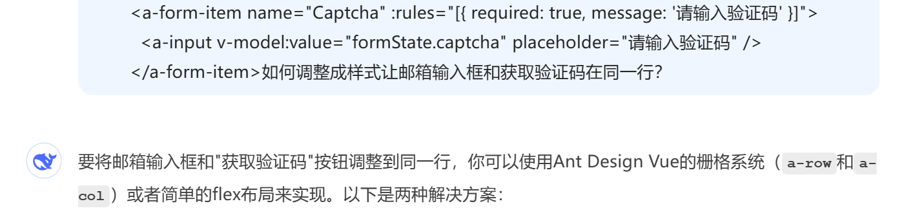

# 详细设计

## 当前注册功能的痛点

原本的用户注册的问题：可能存在**恶意刷号**的风险：


**怎么解决？**

- 验证码：需要配合前端一起，并且需要引入框架，实现相对简单点，但是后续找回密码之类的需求可能做不到
- 限定注册类型：只能是邮箱注册，但这同样存在使用同一个邮箱来重复恶意刷的情况，需要进行进一步的并发控制。
  - 前端加按钮的冷却时间：弊端是防不住直接通过接口调用，甚至最简单的打开F12进行请求的XHR重放都能绕过这个按钮冷却机制
  - 接口层防止重复提交方案，这也是本次最终实现所采用的方案

**邮箱注册的优势：**

- 邮箱需通过SMTP验证才能激活，过滤大部分虚假注册
- 防止机器人批量注册（需配合验证码机制）
- 短信验证要对接运营商花钱
- 密码找回的核心验证方式

这里选择限定注册类型来实现，主要是想学习下分布式锁的实际运用，以及对接邮件系统的代码实现，验证码的话暂时先放一下吧，目测技术实现没有啥难度。

## 原型图


参考这个实现流程，我们前端后端一起分析：

1. 前端：输入邮箱，点击获取验证码，触发邮箱发送验证码注册事件
2. 后端：接收到邮箱注册请求 ，校验邮箱合法性之后异步进行邮件发送任务，将系统生成的验证码发送到用户邮箱 ，之后记录邮箱与验证码到redis，作为后续注册接口的校验依据
3. 前端：接收到验证码之后，输入验证码和密码，点击立即注册，触发注册事件（用户信息入库）
4. 后端：接收到用户注册信息（邮箱，验证码，密码）来逐一进行校验，通过之后就完成信息入库，释放Redis，注册流程结束

## 针对注册场景可能存在的异常场景

主要解决：恶意用户使用同一个邮箱地址进行大量注册

**实现方案：双重检查锁来实现并发安全以及防止重复提交**

**为什么要使用双检锁来进行限制？**

同一时刻数个发送邮件的请求打过来，如果只用验证码来作为检查重复的话那么请求都会先走到发送邮件哪一步的（因为此刻redis里面还有设置验证码缓存），相当于没有防住恶意流量，需要在第一部就加上个sentnx的分布式锁，拿到这个锁之后再检查一下有没有验证码，都走通才具备发送邮件的资格。

**源码解析：**

```java
/**
     * 安全发送验证码（100%防并发）
     */
    @Override
    public String secureSendCode(String userEmail) {
        String lockKey = EMAIL_LOCK + userEmail;
        String codeKey = EMAIL_CODE + userEmail;
        // 1. 获取分布式锁
        String lockValue = UUID.randomUUID().toString();
        boolean locked = Boolean.TRUE.equals(redisTemplate.opsForValue().setIfAbsent(lockKey, lockValue, CODE_TTL, TimeUnit.SECONDS));
        if (!locked) {
            throw new BusinessException(OPERATION_ERROR, "操作过于频繁");
        }
        try {
            // 2. 双重检查是否已存在有效验证码
            if (Boolean.TRUE.equals(redisTemplate.hasKey(codeKey))) {
                throw new BusinessException(OPERATION_ERROR, "验证码已发送");
            }
            // 查询数据库是否已经包含这个邮箱
            Long count = this.getBaseMapper().selectCount(new QueryWrapper<User>().eq("userAccount", userEmail));
            ThrowUtils.throwIf(count > 0, ErrorCode.PARAMS_ERROR, "账号已存在, 请直接登录!");
            // 3. 生成并存储验证码
            String code = RandomUtil.randomNumbers(4);
            Map<String, Object> contentMap = new HashMap<>();
            contentMap.put("code", code);
            // Start >>> 优化内容：异步邮件发送
            CompletableFuture.runAsync(() -> {
                try {
                    // 发送验证码
                    emailManager.sendEmail(userEmail, "注册验证码 - 月辰云图库", contentMap);
                } catch (Exception e) {
                    // 发送失败就释放锁
                    redisTemplate.execute(releaseLockScript, Collections.singletonList(lockKey), lockValue);
                    throw new BusinessException(OPERATION_ERROR, "邮件发送失败");
                }
            }).thenRunAsync(() -> {
                // 当发送验证码错误的时候，不会执行存储验证码到redis
                // 存储验证码到redis 5 分钟过期
                // 验证码key需要登完成注册流程之后才释放
                redisTemplate.opsForValue().set(codeKey, code, CODE_TTL, TimeUnit.SECONDS);
                // 邮件发送完成了，并且redis的验证码key也设置好了，然后可以释放掉锁key了，之后如果还是有同样的请求进来会被第二个锁检测到
                redisTemplate.execute(releaseLockScript, Collections.singletonList(lockKey), lockValue);

            });
            return code;
        }
        finally {
            // 不能在此处释放锁，因为在并发场景下提前释放掉锁之后会导致一开始的请求重复打到发邮件那一步
            // 直接在redis客户端执行lua脚本命令
            // redisTemplate.execute(releaseLockScript, Collections.singletonList(lockKey), lockValue);
        }
    }
```

## 压测结果

**压测之后的结果，符合预期：**


# 前端设计

## 邮箱发送验证码事件触发

先从后端场景分析一下需要前端做什么事：

后端首先发送验证码的接口的入参就很简单，一个邮箱字符串就行了，那么前端的话重点要实现的就是：

- 一个邮箱的**输入框**以及一个获取验证码的**点击按钮**用来触发发送邮件的事件

那么我们对代码进行改造：

### HEML


注意：

**v-model：**为**表单元素**创建双向数据绑定

**@click="handleGetCode"**：点击事件函数的触发位置

### API定义：

基本上就是照猫画虎的写呢，主要变动点就是出入参的变化还要路径


### script


- 定义变量用来**接收表单元素值**
- 定义方法来调用触发获取验证码接口，注意方法内的语法，先定义变量，然后声明这个变量是我们定义的入参，然后绑定第一步获取到表单元素值

### 最终实现


不难看出啊，现在的样式很丑，后面需要加CSS优化，还要整个注册的提交优化

#### 样式美化：

这里直接把相关问题喂给AI：



最终采用：Flex布局

```html
<a-form-item name="userEmail" :rules="[{ required: true, message: '请输入邮箱' }, { type: 'email', message: '请输入有效的邮箱地址' }]">
  <div style="display: flex; gap: 10px;">
    <a-input v-model:value="userEmail" placeholder="请输入邮箱" style="flex: 1;" />
    <a-button type="primary" @click="handleGetCode">获取验证码</a-button>
  </div>
</a-form-item>
```


### 注册事件修改

这块就直接修改相关的前后端代码就行了

**前端：**接口入参调整

**后端：**对邮箱的验证，对验证码的比对

# 存留问题&待优化点

输入大量的无效邮箱怎么办？（可以过校验，但是邮箱地址无效，发送的话会被退回来）

IP限流


